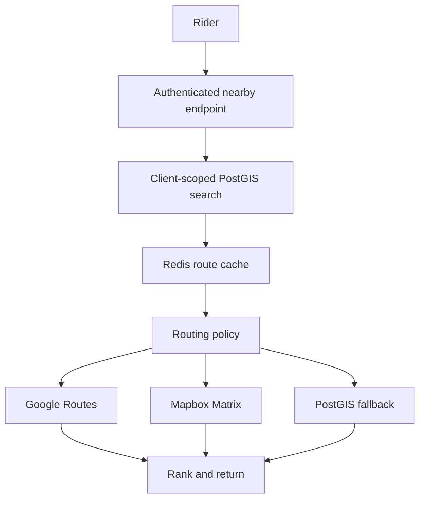

# Nearest Hub implementation

## Repository analysis

The API is NestJS 12, Prisma 6.19, PostgreSQL. Hubs have decimal latitude and longitude, `status`, `deletedAt`, and `clientId`. The Rider profile links a User to a Client. AccessTokenGuard validates the session and User; RolesGuard restricts the endpoint to RIDER. Redis is provisioned in Compose and Terraform but no Redis client package is installed. This repository has no Flutter source, location service, or existing map integration.

## Database

Apply migration `20260926220000_nearest_hub`. It enables PostGIS, adds Hub.location as geography(Point,4326), backfills valid existing coordinates in longitude/latitude order, and creates a GiST index. A database trigger synchronizes location on Hub coordinate writes; null and invalid legacy coordinates produce a null location without deleting records. Prisma maps location as Unsupported. The migration also creates one monthly aggregate row per provider.

## API

`GET /api/v1/rider/hubs/nearby?latitude=28.4595&longitude=77.0266&radiusKm=10&limit=5` requires a Rider bearer token. Client identity comes from the Rider profile, not request parameters. The response uses the project's `{ data: ... }` envelope. `data` contains `location`, `routingSource`, `hubs`, and `meta`. Each Hub contains code, name, address, coordinates, straight-line meters, nullable road meters, nullable duration, status, and navigation coordinates. Empty results are HTTP 200. PostGIS fallback returns null road distance and duration.

The PostGIS repository filters `clientId`, ACTIVE status, nondeleted records, and radius with ST_DWithin. It sorts by ST_Distance and caps candidates before routing. The final result sorts by duration and road distance when every candidate has a route; otherwise it sorts by straight-line distance. No Rider location is persisted. Fastify request logging strips query strings so GPS coordinates are not logged.

## Provider policy and operations

`ROUTING_PROVIDER_ORDER` controls order. Defaults are Google (12,000 configured units), Mapbox (15,000 configured units), then PostGIS. Set `ROUTING_PROVIDER_ORDER=MAPBOX,GOOGLE` to reverse. Set `GOOGLE_ROUTES_ENABLED=false` or `MAPBOX_ROUTES_ENABLED=false` to disable a provider. Change monthly limits with `GOOGLE_ROUTES_MONTHLY_LIMIT` and `MAPBOX_ROUTES_MONTHLY_LIMIT`. A matrix element counts as one usage unit in each adapter; check provider billing terms when changing API options.

Google uses Routes computeRouteMatrix with a narrow field mask. Mapbox uses a one-source Matrix request. On timeout, HTTP error, or quota rejection, the orchestrator tries the next provider. Three failures open a local 30-second circuit. A successful request closes it. The quota service exposes `getMonthlyRoutingUsage()` for a future internal dashboard; it is not exposed to Riders.

Redis quota keys are `evseye:routing:quota:PROVIDER:YYYY-MM`, based on `ROUTING_QUOTA_TIMEZONE`. A Lua script atomically checks and increments the configured cap, then sets a 90-day TTL. Monthly rollover uses a new key; there is no reset job. To inspect usage, run `redis-cli GET evseye:routing:quota:GOOGLE:YYYY-MM` or the MAPBOX equivalent. After provider invocation, reserved units stay consumed even when the call fails because the provider may bill it. Failures before Redis reservation consume nothing. PostgreSQL monthly aggregate rows report attempted requests. Redis is the enforcing counter; restoration from the aggregate is an operational consideration after Redis data loss.

Successful routes are cached for `ROUTING_CACHE_TTL_SECONDS` using a bucketed origin, destination ID and coordinates, and driving mode. Cache lookup precedes quota reservation. Identical requests in one API process share an in-flight promise. Cross-process coalescing is not implemented; atomic quota still prevents overrun.

To test failover, enable both providers and set Google's configured limit below the candidate matrix size; requests should use Mapbox. Disable or exhaust Mapbox as well to exercise PostGIS. Do not expose backend routing credentials to Flutter.

## Flutter integration contract

The Flutter Rider app is absent from this repository. It should request a recent one-shot location, handle permission denied/permanently denied, disabled services, and timeout, then call this endpoint. Show the first Hub in a compact Home card and all returned Hubs in a list/map screen. Display estimated minutes only when `travel.durationSeconds` is non-null. Navigate using a Google Maps URL built from `navigation.latitude` and `navigation.longitude`, with a browser URL fallback. No continuous tracking is required.

## Cost protection

PostGIS caps candidates before routing; Redis route caching, per-process coalescing, atomic monthly provider quotas, and a quota-free PostGIS fallback bound external usage.

## Verification and current limits

API typecheck and build pass. The API unit suite passes (219 tests), as does the existing end-to-end suite (8 tests). Four focused Nearest Hub tests cover Rider client scoping, empty candidates, a quota boundary, and provider failover plus cache reuse. A live Redis check launched ten concurrent reservations against a five-unit cap: five were accepted and recorded usage was five.

Structured log events record request counts and latency, candidate counts, cache hits/misses, provider calls and failures, quota exhaustion, and fallback without Rider coordinates or IDs. No metrics exporter or alerting system exists in this API, so thresholds and external metrics dashboards are not wired. The migration has not been applied to a live database in this workspace. The Flutter Rider app is absent and must consume the documented endpoint in its own repository.
