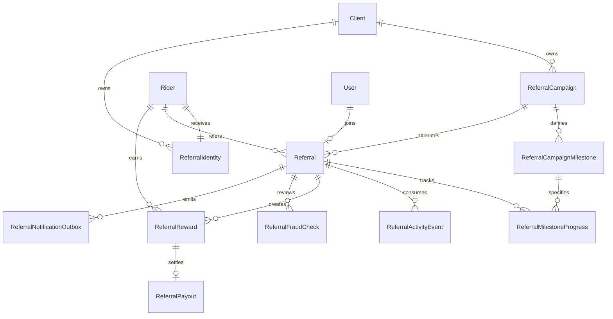

# Refer & Earn backend

## Architecture

The client’s active subscription must include the `REFER_AND_EARN` package feature. A Client Admin creates a draft campaign, defines its milestones, then activates or schedules it. A Rider gets a stable client-scoped referral code and share URL. Another authenticated Rider can submit the code while onboarding or call the attribution endpoint. Attribution stores the campaign rules and terms as a snapshot. Progress is driven by idempotent KYC, activation, allocation and trusted activity events. Qualification creates separate referrer and referee reward ledger entries and reserves the configured campaign budget in the same serializable transaction. Client Admins review rewards and record manual payouts. Analytics aggregate the persisted funnel and reward ledger.

All referral business tables have `clientId`. Foreign keys between the important entities include `clientId`; normal Client Operations and Rider endpoints obtain it from the authenticated session. Only Super Admin can post upstream activity events for a specified Client. The rider-facing API returns masked referee mobile numbers and never exposes the reward payment reference.

```mermaid
sequenceDiagram
    participant A as Rider A
    participant API as Referral API
    participant B as Rider B
    participant Ops as Client Operations
    participant DB as Referral ledger
    A->>API: Get code, link, and QR payload
    API-->>A: Share details
    A-->>B: Share referral link
    B->>API: Authenticate and submit code
    API->>DB: Attribute once; snapshot campaign
    B->>API: Register and finish onboarding
    API->>DB: Rider activation event
    B->>API: Complete KYC
    API->>DB: KYC verified event
    B->>API: Receive vehicle allocation
    API->>DB: Vehicle allocated event
    API->>DB: Trusted ride/activity events and milestone progress
    API->>DB: Qualify, reserve budget, create two rewards
    Ops->>API: Approve and process rewards
    Ops->>API: Record payout reference
    API->>DB: Mark paid and enqueue notification event
```



The Prisma models and enums are in `apps/api/prisma/schema.prisma`. Migration `20260925150000_referral_engine` is additive; it does not remove existing data. Money and progress quantities use Prisma Decimal. Unique indexes prevent multiple attributed referrers for one referee, repeated reward beneficiaries, duplicate payouts and duplicate source events. Scheduled reconciliation expires referrals and checks KYC, activation and allocation facts missed by the synchronous path.

## API contracts

Every response uses the existing `{ "data": ... }` envelope. Use an authenticated Rider token for `/api/v1/rider-app/referrals`, a Client Admin or Operations Manager token for `/api/v1/client/referrals`, and a Super Admin token for the trusted event endpoint. Client Admin is required for writes in Client Operations.

| Actor | Method and path | Purpose |
| --- | --- | --- |
| Rider | `GET /api/v1/rider-app/referrals/home` | Campaign, terms, reward values, referral code, share URL, QR payload and earnings summary |
| Rider | `POST /api/v1/rider-app/referrals/invites` | Create a single-use invitation token and link |
| Rider | `POST /api/v1/rider-app/referrals/attribute` | Submit `{ "referralCode": "EVS-ABCDEFGH", "inviteToken": "optional" }` |
| Rider | `GET /api/v1/rider-app/referrals` | Paginated own referrals; optional status |
| Rider | `GET /api/v1/rider-app/referrals/notifications` | Paginated in-app referral activity feed |
| Rider | `GET /api/v1/rider-app/referrals/:id` | Own referral progress and reward statuses |
| Public | `GET /api/v1/public/referrals/resolve?code=...` | Safe campaign title and description for link resolution |
| Client Ops | `GET/POST /api/v1/client/referrals/campaigns` | List and create campaigns |
| Client Ops | `GET/PUT /api/v1/client/referrals/campaigns/:id` | Read or edit a draft |
| Client Ops | `POST /api/v1/client/referrals/campaigns/:id/{activate,pause,close,cancel,duplicate}` | Campaign lifecycle |
| Client Ops | `GET /api/v1/client/referrals/campaigns/:id/analytics` | Funnel, conversion, rewards, CAC |
| Client Ops | `GET /api/v1/client/referrals` and `GET /api/v1/client/referrals/:id` | Paginated referrals and detail; filter by status, campaign, dates, rider, fraud and reward status |
| Client Ops | `POST /api/v1/client/referrals/:id/{qualify,reject}` | Audited manual decisions with reason |
| Client Ops | `POST /api/v1/client/referrals/:id/fraud/{flag,clear}` | Audited fraud review |
| Client Ops | `GET /api/v1/client/referrals/rewards` | Paginated rewards |
| Client Ops | `POST /api/v1/client/referrals/rewards/:id/{approve,reject,processing,paid}` | Reward workflow and manual payout reference |
| Super Admin | `POST /api/v1/platform/clients/:clientId/referral-events` | Trusted ride/delivery/training/payment milestone event |

For campaign creation, send a code, name, terms, ISO start/end dates, registration and qualification validity days, reward types and decimal values, and a nonempty `milestones` array. Each milestone has `milestoneType`, `operator`, decimal `targetValue`, `sequence`, and optional `mandatory`. Optional limits and budget are Client-specific. Example:

```json
{
  "code": "GURGAON_RIDERS",
  "name": "Gurgaon Rider Acquisition",
  "termsAndConditions": "Client-approved campaign terms",
  "startAt": "2026-10-01T00:00:00.000Z",
  "endAt": "2026-11-01T00:00:00.000Z",
  "registrationValidityDays": 7,
  "qualificationValidityDays": 30,
  "referrerRewardType": "CASH",
  "referrerRewardValue": "500.00",
  "refereeRewardType": "CASH",
  "refereeRewardValue": "200.00",
  "campaignBudget": "200000.00",
  "maxQualifiedReferralsPerRider": 10,
  "referralLimitPeriod": "MONTHLY",
  "milestones": [
    { "milestoneType": "KYC_VERIFIED", "operator": "EQ", "targetValue": "1", "sequence": 1 },
    { "milestoneType": "RIDER_ACTIVATED", "operator": "EQ", "targetValue": "1", "sequence": 2 },
    { "milestoneType": "VEHICLE_ALLOCATED", "operator": "EQ", "targetValue": "1", "sequence": 3 },
    { "milestoneType": "COMPLETED_RIDES", "operator": "GTE", "targetValue": "50", "sequence": 4 }
  ]
}
```

The values above are an example, not runtime defaults. A trusted ride source sends `{ "riderId": "...", "milestoneType": "COMPLETED_RIDES", "quantity": "1", "sourceEventId": "ride-123", "occurredAt": "2026-10-12T10:00:00.000Z" }`. Repeating `sourceEventId` does not increment progress. Payment records use `{ "paymentReference": "...", "paymentMethod": "BANK_TRANSFER" }`; this records a settlement already made by operations and does not itself transfer funds.

## Configuration and rollout

The feature catalog seeds `REFER_AND_EARN` in `RIDER_MANAGEMENT` and changes `CAPTURE_REFERRAL` to an optional `REFERRAL_CODE` onboarding field. Attach both features to the intended package through existing Package Feature administration. No package receives Refer & Earn by default. `SEED_REFERRAL_DEMO=1` during a development seed enables a sample entitlement and draft campaign; leave it unset outside development. A campaign must be activated by Client Admin before Rider sharing works.

The Rider app should render `home` and `mine`, generate a QR image from the returned `qrPayload`, retain `code` and optional `invite` from a link, then submit them with the authenticated Rider session. `CAPTURE_REFERRAL` on the onboarding step also submits the code to the same attribution logic. The client’s verified primary domain must serve `/rider/referral` and route it to the app or store. The backend resolves codes; app universal links and deferred install attribution need mobile/web routing.

Client Operations can use the APIs above for campaign forms, referral search/details, reward review, payouts, fraud review, and analytics. A browser UI is not part of this backend change. No ride/delivery store or notification provider exists in this repository: activity can enter through the restricted upstream endpoint, and referral events are persisted to `ReferralNotificationOutbox` for the Rider in-app feed and later provider delivery. The mobile app can poll the activity feed; push/SMS/WhatsApp delivery needs a worker and provider. Do not display outbox events as externally delivered until that integration is connected. Manual payout is the only supported settlement mode.

Tests cover feature access, attribution isolation and duplicate handling, campaign validation, qualification and budget, idempotent progress, and reward transitions. Verify locally with `pnpm --filter @evs-eye/api typecheck`, `pnpm --filter @evs-eye/api lint`, `pnpm --filter @evs-eye/api test`, and `pnpm --filter @evs-eye/api build`.
